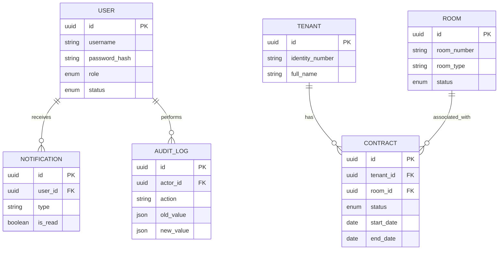

# SMART RENTAL – Hệ Thống Quản Lý Nhà Trọ Nền Tảng Đám Mây


## 1. Giới thiệu
**Smart Rental** là giải pháp phần mềm quản lý nhà trọ, chung cư mini, và phòng cho thuê theo mô hình Modern SaaS Dashboard. Hệ thống giúp tự động hóa các quy trình quản lý thủ công, tối ưu hóa doanh thu và quản trị rủi ro thông qua nền tảng điện toán đám mây.

## 2. Problem Statement (Vấn đề)
*   **Thất thoát dữ liệu**: Quản lý bằng sổ sách hoặc Excel dễ dẫn đến sai sót, nhầm lẫn dữ liệu khách thuê, tiền cọc.
*   **Quản lý rời rạc**: Chủ trọ khó nắm bắt trạng thái phòng (trống, đã thuê, bảo trì) theo thời gian thực.
*   **Rủi ro tài chính**: Thường xuyên quên ngày hết hạn hợp đồng dẫn đến trống phòng không có kế hoạch.
*   **Thiếu minh bạch**: Khó truy vết ai là người đã thay đổi thông tin hợp đồng hay giá phòng (nhân viên hay chủ trọ).

## 3. Solution (Giải pháp)
Smart Rental giải quyết các vấn đề trên thông qua một nền tảng tập trung:
*   Trạng thái phòng được cập nhật tự động bằng Transaction khi Hợp đồng thay đổi.
*   Hệ thống cảnh báo tự động khi Hợp đồng sắp hết hạn.
*   Phân quyền chặt chẽ và Hệ thống Log (Ghi vết) mọi hành động của người dùng.

## 4. Objectives (Mục tiêu)
*   Tạo ra một MVP (Minimum Viable Product) có thể triển khai thực tế ngay lập tức.
*   Kiến trúc linh hoạt (Modular Architecture) để dễ dàng mở rộng các tính năng như Thanh toán VNPay/Momo, Chat nội bộ sau này.

## 5. MVP Features
*   **Authentication & Authorization**: Đăng nhập an toàn (JWT + bcrypt), phân quyền Role-based Access Control (RBAC).
*   **Dashboard**: Tổng hợp KPI doanh thu, tỷ lệ lấp đầy, số lượng hợp đồng hết hạn bằng biểu đồ Recharts.
*   **Quản lý Phòng (Rooms)**: CRUD phòng trọ, tự động chuyển trạng thái `AVAILABLE` ↔ `RENTED` dựa trên Hợp đồng.
*   **Quản lý Khách thuê (Tenants)**: Quản lý thông tin, kiểm tra định danh (CCCD) duy nhất.
*   **Quản lý Hợp đồng (Contracts)**: Gắn kết Khách và Phòng, kiểm soát tiền cọc, tự động rollback (ACID Transaction) nếu có lỗi.
*   **Báo cáo (Reports)**: Biểu đồ doanh thu và cơ cấu phòng tĩnh/động.
*   **Cảnh báo (Notifications)**: Cron-job chạy ngầm bắn thông báo hợp đồng sắp hết hạn.
*   **Lịch sử hệ thống (Audit Logs)**: Tự động ghi nhận mọi sự kiện Thêm/Sửa/Xóa của tất cả các thực thể (Chỉ Admin).

## 6. User Roles
*   **ADMIN**: Toàn quyền hệ thống. Xem được Audit Logs và Quản lý Users.
*   **LANDLORD (Chủ trọ)**: Xem Dashboard, Reports, Quản lý Phòng, Khách, Hợp đồng, Nhận thông báo.
*   **STAFF (Nhân viên)**: Chỉ thao tác CRUD cơ bản trên Phòng, Khách, Hợp đồng để vận hành hàng ngày (Không xem được Báo cáo tài chính).

## 7. System Architecture
Hệ thống được thiết kế theo kiến trúc Client-Server tiêu chuẩn:
*   **Client (Frontend)**: React SPA giao tiếp qua REST API (bảo vệ bằng JWT Bearer Token trong Header).
*   **Server (Backend)**: Node.js/Express cung cấp Stateless REST API. Middleware xác thực và bắt lỗi tập trung.
*   **ORM Layer**: Prisma DB đóng vai trò cầu nối, đảm bảo Type-safe từ DB lên tới Frontend.
*   **Database**: PostgreSQL đảm bảo tính toàn vẹn (ACID) cho dữ liệu.

## 8. Technology Stack
*   **Frontend**: React 18, TypeScript, Vite, Tailwind CSS v4, Lucide React, Recharts, Axios, React-hot-toast.
*   **Backend**: Node.js, Express, TypeScript, JWT, bcrypt, node-cron.
*   **Database**: PostgreSQL, Prisma ORM.

## 9. Database Architecture & Schema
### ERD (Entity Relationship Diagram)


## 10. Project Structure
```text
smart-rental/
├── frontend/             # React SPA (Vite + TS)
│   ├── src/
│   │   ├── components/ui/ # Reusable UI components
│   │   ├── contexts/      # Auth & Global State
│   │   ├── layouts/       # Sidebar, Header, Shell
│   │   ├── pages/         # Dashboard, Rooms, Contracts...
│   │   └── services/      # Axios API wrappers
├── backend/              # Express API Server
│   ├── src/
│   │   ├── controllers/   # Business logic (CRUD, Audit)
│   │   ├── middlewares/   # Auth Guard, Error Handler
│   │   ├── routes/        # REST Endpoints
│   │   ├── jobs/          # Background cron jobs
│   │   └── utils/         # Prisma client, Helpers
├── database/             # Prisma DB setup
│   ├── prisma/
│   │   ├── schema.prisma  # DB Models
│   │   └── seed.ts        # Seed data script
├── dataset/              # Mẫu CSV (50 Phòng, 30 Khách...)
├── .gitignore
├── .env.example
└── README.md
```

## 11. Installation & Environment Setup
### Yêu cầu tiên quyết
*   Node.js (v18+)
*   PostgreSQL (v14+)

### Cài đặt
1. **Clone repository** và cài đặt dependencies cho tất cả modules:
   ```bash
   cd frontend && npm install
   cd ../backend && npm install
   cd ../database && npm install
   ```
2. **Cấu hình môi trường**:
   Copy file `.env.example` thành `.env` trong thư mục `backend/` và `database/`. Cập nhật `DATABASE_URL`.
3. **Triển khai Database & Data Mẫu**:
   ```bash
   cd database
   npx prisma db push
   npx prisma generate
   npm run db:seed
   ```
4. **Khởi chạy Hệ thống**:
   *   Mở Terminal 1: `cd backend && npm run dev`
   *   Mở Terminal 2: `cd frontend && npm run dev`

## 12. Demo Account
Sử dụng các tài khoản sau để test hệ thống (Password chung: `123456`):
*   **Admin**: `admin`
*   **Landlord**: `landlord1`, `landlord2`
*   **Staff**: `staff1` (Staff2 đang bị `LOCKED` để test chức năng cấm đăng nhập).

## 13. MVP Limitations & Future Development
*   **Giới hạn hiện tại**: Chưa tích hợp cổng thanh toán online, chưa có chức năng xuất hợp đồng ra file PDF/Word, chức năng Upload hình ảnh phòng trọ (đang dùng mô tả text).
*   **Roadmap (Phiên bản tiếp theo)**:
    1. Tích hợp thanh toán VNPay/MoMo để thu tiền thuê hàng tháng tự động.
    2. Cổng Portal riêng dành cho Khách thuê (Tenant) tự login xem hóa đơn.
    3. Export dữ liệu ra Excel/PDF.
    4. Chat trực tuyến giữa Tenant và Landlord.

## 14. API Documentation (Core)
*   `POST /api/auth/login`: Xác thực và trả về JWT Bearer Token.
*   `GET /api/dashboard`: Lấy KPIs, Occupancy Rate, Revenue.
*   `POST /api/contracts`: Tạo hợp đồng mới (ACID Transaction với bảng Room).
*   `GET /api/audit-logs`: Truy xuất lịch sử thay đổi (Chỉ Admin).

---
*Developed as a Smart Rental MVP for modern property management.*
